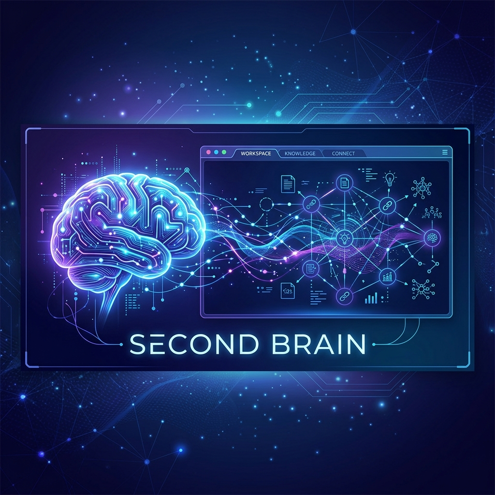
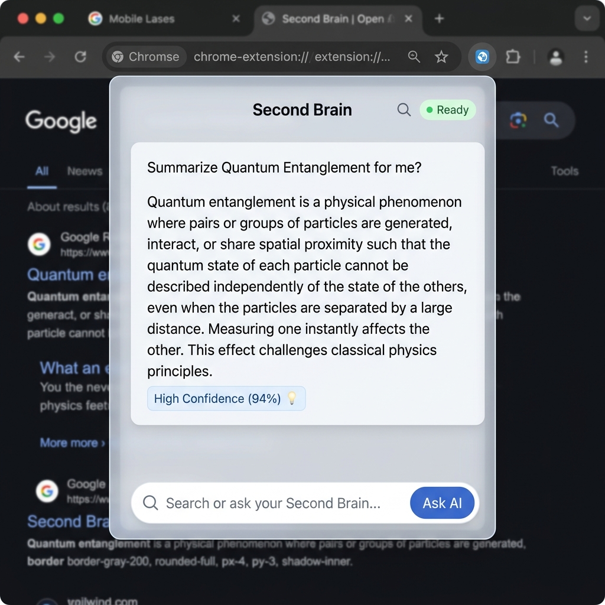
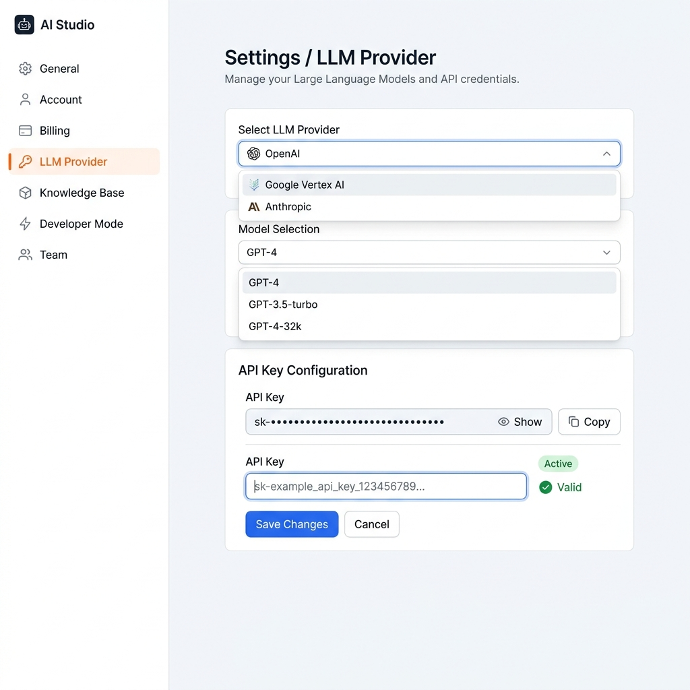
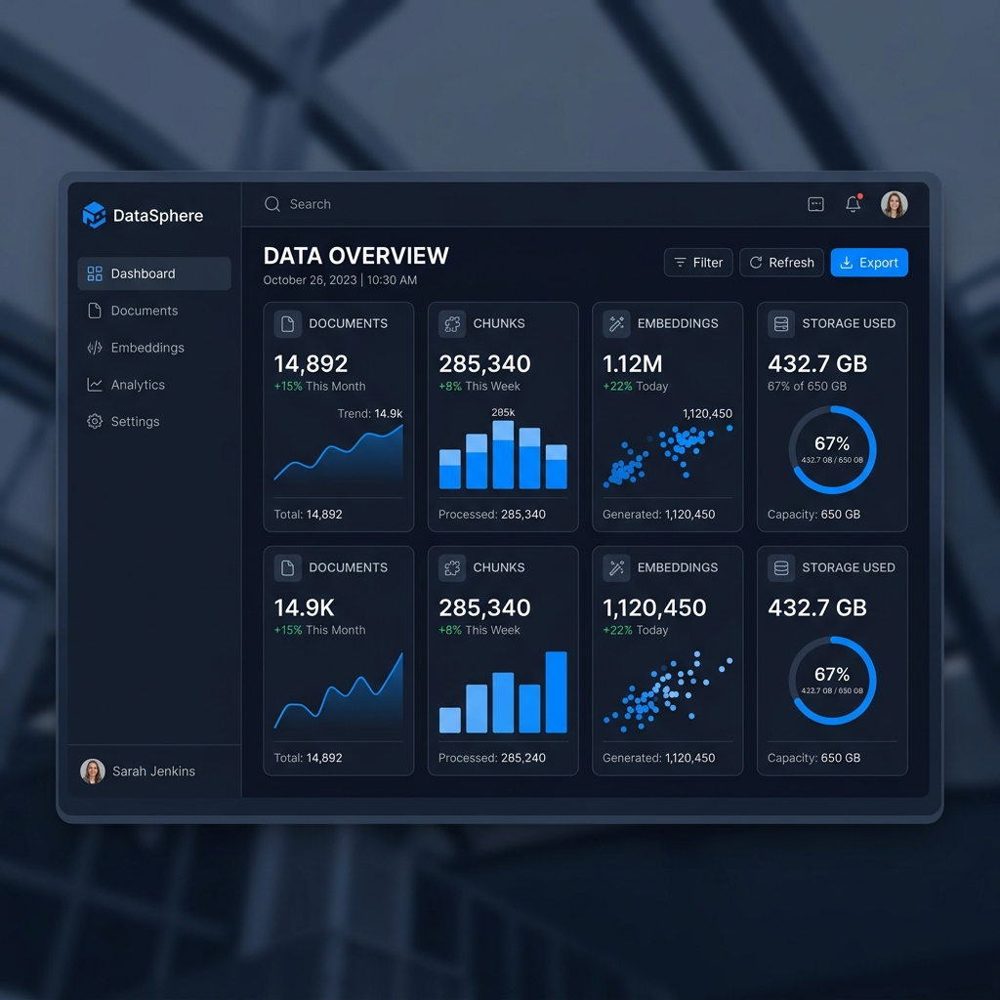
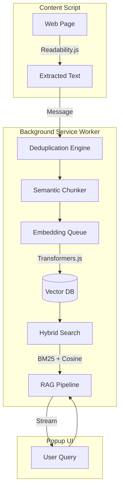

<div align="center">
  
</div>

# Second Brain Chrome Extension

Second Brain is a sophisticated Chrome Extension that transforms the way you interact with web content. By capturing, embedding, and indexing the pages you visit *locally*, it allows you to query your own personal knowledge base with AI, all while keeping your data private and secure.

## 🚀 Key Features

- **Local-First Vector Database**: Uses IndexedDB (via Dexie) to store document chunks and dense embeddings.
- **In-Browser Embeddings**: Leverages Transformers.js to run the `all-MiniLM-L6-v2` embedding model directly in your browser using WebAssembly. No external API required for embeddings!
- **Hybrid Search Architecture**: Combines Dense Vector Search (cosine similarity) with Sparse Search (Custom BM25 algorithm) using Weighted Reciprocal Rank Fusion (WRRF).
- **Intelligent RAG Pipeline**: Uses the retrieved context to ground the LLM's responses, drastically reducing hallucinations.
- **Provider Agnostic**: Currently supports Google Gemini, with an extensible architecture for adding local LLMs (like WebLLM).
- **Privacy Focused**: Your indexed pages and vectors never leave your device. 

## 🖼 UI Preview

| Chat Popup | Settings Page | Knowledge Dashboard |
| :---: | :---: | :---: |
|  |  |  |

## 🏗 Architecture

The system is designed with a strict separation of concerns, orchestrated through a background service worker.



### Core Modules
1. **Deduplication Engine**: Prevents indexing the same content multiple times using content hashes and versioning.
2. **Semantic Chunker**: Intelligently splits HTML/Markdown into overlapping chunks that respect paragraph and sentence boundaries.
3. **Retrieval Provider**: Combines inverted indices for BM25 and brute-force vector search for semantic matching.
4. **LLM Provider Factory**: A clean abstraction layer for streaming answers from various language models.

## 🛠 Tech Stack

- **React 18** + **TypeScript**
- **Vite** + **CRXJS** (Chrome Extension tooling)
- **Tailwind CSS** (for UI styling)
- **Dexie.js** (IndexedDB wrapper)
- **Transformers.js** (In-browser ML)

## 📦 Setup & Installation

### Development Build

1. Clone the repository:
   ```bash
   git clone https://github.com/your-org/second-brain-extension.git
   cd second-brain-extension
   ```
2. Install dependencies:
   ```bash
   npm install
   ```
3. Run the development server:
   ```bash
   npm run dev
   ```
4. Load into Chrome:
   - Go to `chrome://extensions/`
   - Enable **Developer mode**
   - Click **Load unpacked**
   - Select the `dist` folder generated by the build process.

### Production Build

```bash
npm run build
```

## 🧠 Usage

1. Open the **Options Page** to configure your LLM Provider (e.g., input your Gemini API Key).
2. Browse the web normally. The extension automatically indexes pages you spend significant time reading.
3. Click the extension icon to open the **Popup UI**.
4. Ask a question! The AI will search your personal knowledge base and stream a grounded answer, complete with confidence scores and citations.

## 🤝 Contributing

We welcome contributions! Please see [CONTRIBUTING.md](./CONTRIBUTING.md) for details on our code of conduct and development process.

## 🔒 Security

For security policies and reporting vulnerabilities, see [SECURITY.md](./SECURITY.md).

## 📄 License

This project is licensed under the MIT License - see the LICENSE file for details.
