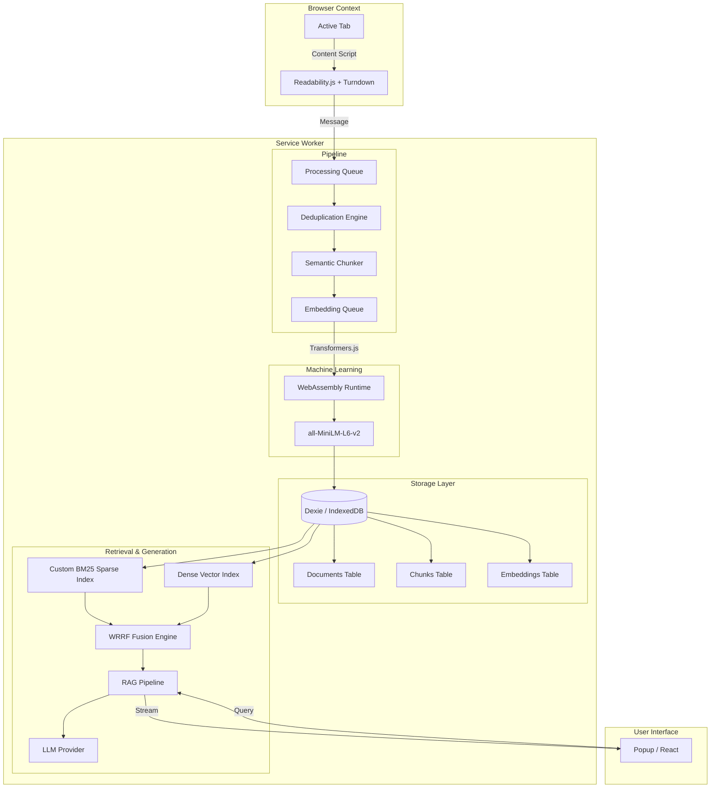

# Architecture Overview

Second Brain is a local-first Chrome extension that turns your browser into a semantic knowledge base. The architecture strictly separates concerns between content extraction, background processing, and user interface.

## System Diagram

## Extension Lifecycle

1. **Initialization**: On install or browser startup, the Service Worker (`background.ts`) initializes the local vector indices and loads `Transformers.js` models into WebAssembly memory.
2. **Capture Pipeline**: 
    - The `chrome.tabs.onUpdated` listener detects when a user has stayed on a webpage for a significant duration (default >15 seconds).
    - A content script injects `Readability.js` to extract main content and strips unnecessary HTML, then converts to Markdown via `Turndown`.
3. **Deduplication**: 
    - The document is hashed and checked against `Dexie` IndexedDB to avoid re-indexing.
    - If the URL exists but the hash differs, it's versioned as an update.
4. **Chunking & Embedding**:
    - The `Semantic Chunker` splits markdown into contextually meaningful pieces.
    - The `EmbeddingQueue` batches these chunks and passes them to `Transformers.js` running entirely in the background thread.
5. **Retrieval**:
    - When a user queries via `Popup.tsx`, the `HybridSearchEngine` takes over.
    - It runs a Custom BM25 search (Sparse) and a Cosine Similarity Vector Search (Dense) in parallel.
    - Results are merged using Weighted Reciprocal Rank Fusion (WRRF).
6. **Generation**:
    - The top chunks are formatted into an LLM prompt.
    - The LLM streams its response back to the Popup UI, providing live citations.

## Data Flow & Storage

All data lives in IndexedDB, managed by `Dexie.js`:
- `documents`: Canonical URL, title, metadata, version history.
- `chunks`: The split markdown text, linked to a parent document.
- `embeddings`: Float32 arrays representing the semantic vectors, linked to chunks.
